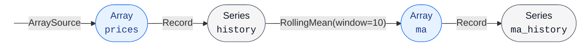

[](https://github.com/bridgekat/tradingflow/actions/workflows/test.yml)

**TradingFlow** is a lightweight library for quantitative investment research that supports multi-frequency market data, formulaic factors, forecasting models, portfolio optimization methods and backtesting in a unified data model. The core runtime is implemented in Rust; a Python wrapper is provided for ease of use with Python's data science ecosystem.

Main design goals:

- **Composable modules:** trading strategies are computation graphs, whose nodes are either data sources or operators. Common sources and operators are provided out of the box, and new ones can be readily implemented in either Rust or Python.
- **Agent-friendly codebase:** code-documentation consistency and a hierarchy of documented modules is maintained to facilitate LLM code exploration and generation. When using LLM coding agents (Claude Code, Codex, OpenCode, etc.), start every session by instructing the agent to read [AGENTS.md](AGENTS.md) and then describe your tasks.

# Get started

Prerequisites: Python 3.12+ and a stable Rust toolchain ([rustup.rs](https://rustup.rs)).

Build commands:

```bash
git clone https://github.com/bridgekat/tradingflow.git
cd tradingflow
pip install -e ".[dev]"
```

TradingFlow uses [Maturin](https://www.maturin.rs/) to automatically compile the Rust core and install the Python package during the `pip install` step.

# Usage

Below is a tiny example that records a synthetic price series and prints its tail. It illustrates the three things you do in every program: create a `Scenario`, register sources and operators, then `run()`.

```python
import numpy as np
import tradingflow as tf

# Example data: 3 months of daily prices generated by a random walk.
timestamps = np.arange("2024-01-01", "2024-04-01", dtype="datetime64[D]")
values = np.random.randn(len(timestamps)).cumsum() + 100.0

# Create a scenario, which stores the computation graph.
sc = tf.Scenario()

# Create a source which feeds timestamped values into the graph.
prices = sc.add_source(tf.sources.ArraySource(timestamps, values, dtype=np.float64))

# Create an operator which transforms or accumulates values from upstream nodes.
# The `Record` operator collects every value of `prices` into a time series.
history = sc.add_operator(tf.operators.Record(prices))

# The `RollingMean` operator reduces a series to the mean of its last-N window,
# emitting a new array snapshot each time the upstream series grows.
ma = sc.add_operator(tf.operators.rolling.RollingMean(history, window=10))

# Record the rolling-mean snapshots back into a series so the full history
# is available for inspection after the run.
ma_history = sc.add_operator(tf.operators.Record(ma))

# Run the event loop until all sources are exhausted.
sc.run()

# Inspect the results via `series_view()`, which returns a `SeriesView` that can be converted to a Pandas `Series`.
print(sc.series_view(ma_history).to_series().tail())
```

The resulting computation graph:



This is the whole pattern. An actual strategy can contain many more operators — `ForwardAdjust`, `LinearRegression`, `Shrinkage`, `MeanVariancePortfolio`, `RandomTrader`, `SharpeRatio` — but the structure stays the same.

You may read the [full documentation here](https://bridgekat.github.io/tradingflow/).[^1]

# Examples

The [`python/examples/`](python/examples/) directory contains end-to-end strategies that load A-shares market data and run full pipelines. To follow along, install the `examples` extras and download data via the helper [a-shares-crawler](https://github.com/bridgekat/a-shares-crawler):

```bash
pip install -e ".[examples]"
python -m a_shares_crawler --help  # For configuration & download instructions
```

**Visualizations** (good starting points to see the data flow):

- [**Daily prices**](python/examples/plot_daily_price.py) — loads daily prices, computes forward-adjusted prices, a moving average, and Bollinger Bands.
- [**Financial data**](python/examples/plot_financial_data.py) — loads equity structure, balance sheet, income statement, and cash flow data; computes market cap and annualized metrics.
- [**Total market cap**](python/examples/plot_total_market_cap.py) — sums per-stock circulating market cap across the whole A-shares market over time.

**Research utilities** (for factor mining):

- [**Mean estimator comparison**](python/examples/factor_ic.py) — computes daily cross-sectional factors (log market cap, log book-to-price, turnover MA), evaluates each one's predictive power using ICs (information coefficients: the rank correlation coefficients), plots cumulative IC curves, and reports their respective IRs (information ratios: the Sharpe ratios of IC curves).
- [**Variance estimator comparison**](python/examples/covariance_gmv.py) — compares the sample covariance estimator with and without Ledoit-Wolf shrinkage, by measuring the realized variance of their respective GMV (global minimum variance) portfolios.

**Backtests** (full strategies with portfolio construction and performance metrics):

- [**Mean-only strategy**](python/examples/mean_strategy.py) — fits a periodic linear regression to predict cross-sectional stock returns, picks the top-ranked names with rank-linear weights, simulates trading with transaction costs, and plots portfolio value, rolling Sharpe, and drawdown vs. a market-cap-weighted index.
- [**Mean-variance strategy**](python/examples/mean_variance_strategy.py) — extends the mean strategy with Ledoit-Wolf shrinkage covariance estimator and Markowitz portfolio optimization, comparing several risk-aversion levels.

[^1]: Currently, most documentations are LLM-generated, and may not be concise enough for human readers. The situation will be improved after core modules are stabilized.
