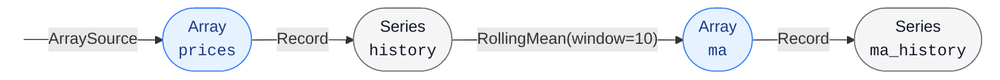

[](https://github.com/bridgekat/tradingflow/actions/workflows/test.yml)

**TradingFlow** is a lightweight library for quantitative investment research that supports multi-frequency market data, formulaic factors, forecasting models, portfolio optimization methods and backtesting in a unified data model. The runtime is implemented in Rust for performance; operators can additionally be written in Python (the [`flowops`](python/flowops/) package) and run on an embedded interpreter, giving strategies direct access to NumPy / SciPy / cvxpy.

Main design goals:

- **Composable modules:** trading strategies are computation graphs, whose nodes are either data sources or operators. Common sources and operators are provided out of the box, and new ones can be readily implemented in either Rust or Python.
- **Agent-friendly codebase:** code-documentation consistency and a hierarchy of documented modules is maintained to facilitate LLM code exploration and generation. When using LLM coding agents (Claude Code, Codex, OpenCode, etc.), start every session by instructing the agent to read [AGENTS.md](AGENTS.md) and then describe your tasks.

# Get started

Prerequisites: a stable Rust toolchain ([rustup.rs](https://rustup.rs)), and — for Python operators / examples — Python 3.12+.

```bash
git clone --recurse-submodules https://github.com/bridgekat/tradingflow.git
cd tradingflow
cargo build                 # the Rust engine + operator library (links libpython)
pip install -e ".[dev]"     # the flowops Python operators + their deps
```

The Rust crate unconditionally embeds a CPython interpreter (via PyO3) to run the `flowops` operators, so `cargo build` needs a Python toolchain on the system — point `PYO3_PYTHON` at your interpreter; see [`examples/README.md`](examples/README.md) for environment setup.

# Usage

A strategy is a computation graph. The three things you do in every program: create a `Scenario`, register sources and operators, then `run()` the event loop. Below is a tiny example that records a synthetic price series, takes a rolling mean, and prints its tail.

```rust
use tradingflow::{Array, Scenario, Series};
use tradingflow::operators::RollingMean;
use tradingflow::sources::ArraySource;

#[tokio::main]
async fn main() {
    // Example data: a random-walk daily price series.
    let timestamps: Vec<_> = (0..90).map(tradingflow::Instant::from_nanos).collect();
    let values: Vec<f64> = /* ... */ vec![100.0; 90];

    let mut sc = Scenario::new();

    // A source feeds timestamped values into the graph; `Record` collects them
    // into a time series; `RollingMean` reduces the series to its last-N mean.
    let prices = sc.add_source(
        ArraySource::new(Series::from_vec(&[], timestamps, values), Array::scalar(0.0)),
        Array::scalar(0.0),
    );
    let history = sc.add_record(prices);
    let ma = sc.add_operator(RollingMean::<f64>::count(10), history);
    let ma_history = sc.add_record(ma);

    // Run the event loop until all sources are exhausted, then inspect results.
    let mut session = sc.build();
    session.run(|_, _| {}).await;
    let series: &Series<f64> = session.value(ma_history);
    println!("{:?}", series.values());
}
```

The resulting computation graph:


```mermaid
flowchart LR
    start(( )):::hidden
    prices(["Array<br/><code>prices</code>"]):::array
    history(["Series<br/><code>history</code>"]):::series
    ma(["Array<br/><code>ma</code>"]):::array
    ma_history(["Series<br/><code>ma_history</code>"]):::series
    start -- ArraySource --> prices
    prices -- Record --> history
    history -- "RollingMean(window=10)" --> ma
    ma -- Record --> ma_history
    classDef hidden fill:#fff,stroke:#fff,color:#fff
    classDef array fill:#e6f2ff,stroke:#3b82f6,color:#1e3a8a
    classDef series fill:#f5f5f5,stroke:#6b7280,color:#111827
```

This is the whole pattern. An actual strategy can contain many more operators — `ForwardAdjust`, `LinearRegression`, `Shrinkage`, `MeanVariancePortfolio`, `RandomTrader`, `SharpeRatio` — but the structure stays the same. Run `cargo doc --open` for the full API reference.

# Examples

The [`examples/`](examples/) directory contains end-to-end strategies that load A-shares market data and run full pipelines (see [`examples/README.md`](examples/README.md) for build/run instructions, and [`docs/design/data-storage.md`](docs/design/data-storage.md) for the columnar storage design). To follow along, install the `examples` extras and download data with the [a-shares-crawler](https://github.com/bridgekat/a-shares-crawler), vendored as a git submodule at [`extern/a-shares-crawler`](extern/a-shares-crawler):

```bash
pip install -e ".[examples]"
git submodule update --init extern/a-shares-crawler
python -m a_shares_crawler --help  # For configuration & download instructions
```

The crawler writes one CSV per symbol by default; pass `--export-long {csv,parquet}...` (or run `python -m a_shares_crawler.export`) to additionally emit consolidated long-format tables (one file per kind, all symbols, sorted by date) — which the examples read.

**Visualizations** (good starting points to see the data flow):

- [**Daily prices**](examples/plot_daily_price.rs) — loads daily prices, computes forward-adjusted prices, a moving average, and Bollinger Bands.
- [**Financial data**](examples/plot_financial_data.rs) — loads equity structure, balance sheet, income statement, and cash flow data; computes market cap and annualized metrics.
- [**Total market cap**](examples/plot_total_market_cap.rs) — builds a cap-weighted A-shares index (top-N by circulating market cap, periodically rebalanced) and plots the sum of constituents' circulating market cap alongside the index's total-return NAV curve.

**Research utilities** (for factor mining):

- [**Factor IC**](examples/factor_ic.rs) — computes daily cross-sectional factors (log market cap, log book-to-price, turnover MA), evaluates each one's predictive power using ICs (information coefficients: the rank correlation coefficients), plots cumulative IC curves, and reports their respective IRs (information ratios: the Sharpe ratios of IC curves).
- [**Variance estimator comparison**](examples/covariance_gmv.rs) — compares the sample covariance estimator with and without Ledoit-Wolf shrinkage, by measuring the realized variance of their respective GMV (global minimum variance) portfolios.

**Backtests** (full strategies with portfolio construction and performance metrics):

- [**Mean-only strategy**](examples/mean_strategy.rs) — fits a periodic linear regression to predict cross-sectional stock returns, picks the top-ranked names with rank-linear weights, simulates trading with transaction costs, and plots portfolio value, rolling Sharpe, and drawdown vs. a market-cap-weighted index.
- [**Mean-variance strategy**](examples/mean_variance_strategy.rs) — extends the mean strategy with Ledoit-Wolf shrinkage covariance estimator and Markowitz portfolio optimization, comparing several risk-aversion levels.
