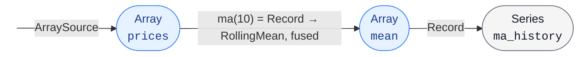

# TradingFlow

[](https://github.com/bridgekat/tradingflow/actions/workflows/test.yml)

A computation-graph framework for quantitative investment research: the `tradingflow-graph` engine (a multithreaded executor for static computation graphs, developed in-tree) plus an operator library on top.

A trading strategy is a static computation graph: feature extraction, model prediction, portfolio optimization, trading simulation and performance evaluation are all operator nodes in this graph. This library provides common reusable nodes as basic building blocks, and handles data loading from various types of sources.

Operator nodes can additionally be written in Python and run on an embedded interpreter, giving strategies direct access to the data science ecosystem of Python.

## Get started

Prerequisites: a stable Rust toolchain ([rustup.rs](https://rustup.rs)), and Python 3.12+ for the `python` feature.

```bash
git clone https://github.com/bridgekat/tradingflow.git
cd tradingflow
cargo build                              # the Rust library and engine
cargo build -p tradingflow --features python  # + the Python operator package
```

To use it, `tradingflow` is the **only dependency** a strategy crate adds — the engine's vocabulary is re-exported through it (see below).

## Repository layout

A Cargo workspace of three crates, plus the Python operator package and the examples:

```text
crates/tradingflow/         the library: data model, operators, sources,
                            the `ingest` event-loop driver (Scenario/Session),
                            and `graph` — the engine's API, re-exported
crates/tradingflow-graph/   the computation-graph engine (parallel, time-free)
crates/tradingflow-macros/  the `segment!` fusion macro
python/tradingflow/         Python operators (predictors, portfolios, metrics)
                            run on the embedded interpreter
examples/                   end-to-end strategies + their market data
```

The engine is a separate crate so it builds, tests, and runs Miri against its own minimal dependency set — but it is not a separate dependency: strategy code reaches it through `tradingflow::graph` and `tradingflow::segment!`. Its concepts (segments, interfaces, notification flags, the graph-level context) are documented in [`crates/tradingflow-graph/README.md`](crates/tradingflow-graph/README.md) — read that before writing a custom operator.

Development:

```bash
cargo test --workspace                        # engine + library + driver tests
cargo test -p tradingflow --features python   # + the embedded-interpreter tests
pytest                                        # the Python operator package
```

The `python` feature links libpython, so it needs `PYO3_PYTHON` and the interpreter's DLL/`site-packages` on the right paths — [`examples/env.ps1`](examples/env.ps1) sets all of it up (`. .\examples\env.ps1`), and [`examples/README.md`](examples/README.md) explains why each variable is needed.

## Examples

The three things you do in every program: create a `Scenario`, register sources and operators, then `run()` the event loop. Below is a tiny example that records a synthetic price series, takes a rolling mean, and prints its tail.

```rust
use tradingflow::{Array, Instant, Scenario, Series, WallClock};
use tradingflow::operators::{as_view, ma, record};
use tradingflow::sources::ArraySource;

#[tokio::main]
async fn main() {
    // Example data: a random-walk daily price series.
    let timestamps: Vec<_> = (0..90).map(Instant::from_nanos).collect();
    let values: Vec<f64> = /* ... */ vec![100.0; 90];

    // `Instant::MIN` is the event time before the first batch arrives — a
    // floor, at or below every event the run can produce.
    let mut sc = Scenario::new(WallClock, Instant::MIN);

    // A source feeds timestamped values into the graph; `as_view` bridges its
    // whole-array cell into the view currency the operators speak; `ma` is a
    // self-recording last-N rolling mean; `record` collects a stream into a
    // time series, stamping each row with the batch's event time — which the
    // session hands to it, so no clock is wired up. Every operator is a
    // lowercase constructor whose generics come from the wiring.
    let prices = sc.add_source(ArraySource::new(
        Series::from_vec([], timestamps, values),
        Array::scalar(0.0),
    ));
    let prices = sc.push(as_view(), prices);
    let mean = sc.push(ma(10), prices);
    let ma_history = sc.push(record(), mean);

    // Run the event loop until all sources are exhausted, then inspect results.
    let mut session = sc.build();
    session.run(|_, _| {}).await;
    let series: &Series<f64, 0> = session.ref_view(ma_history);
    println!("{:?}", series.values());
}
```

The resulting computation graph:


```mermaid
flowchart LR
    start(( )):::hidden
    prices(["Array<br/><code>prices</code>"]):::array
    mean(["Array<br/><code>mean</code>"]):::array
    ma_history(["Series<br/><code>ma_history</code>"]):::series
    start -- ArraySource --> prices
    prices -- "ma(10) = Record → RollingMean, fused" --> mean
    mean -- Record --> ma_history
    classDef hidden fill:#fff,stroke:#fff,color:#fff
    classDef array fill:#e6f2ff,stroke:#3b82f6,color:#1e3a8a
    classDef series fill:#f5f5f5,stroke:#6b7280,color:#111827
```

This is the whole pattern. An actual strategy can contain many more operators — `ForwardAdjust`, `LinearRegression`, `Shrinkage`, `MeanVariancePortfolio`, `RandomTrader`, `SharpeRatio` — but the structure stays the same. Formula-shaped signals compose with the `tradingflow::segment!` macro and the self-recording formula constructors, so `MA(x, 10) − MA(x, 5) > 0 AND NOT LAG(…, 1) > 0` is a two-line fused node — capturing nothing from its environment:

```rust,ignore
tradingflow::segment!(|x: ViewPort<ArrayValue<f64, 1>>| {
    let d = subtract() @ (ma(10) @ x, ma(5) @ x);
    and() @ (greater_than(0.0) @ d, not() @ (greater_than(0.0) @ lag(1) @ d))
})
```

Windowed operators like `ma` / `lag` / `record` need the current timestamp to stamp their rows, but they never take a clock: **event time is ambient**. It is the engine's *graph-level context* — one value the graph owns and hands to every `compute`, which the session advances to the batch's timestamp before each stabilize. So `Record` is *given* the time rather than holding a handle to it, and time stays out of the dependency graph (writing the context dirties no node, so a time-reading operator still recomputes only when its own inputs notify).

Run `cargo doc --open` for the full API reference.

The DAG engine — parallel sparse restabilization plus the graph-level context — lives in `tradingflow-graph`, which is itself time-free. Everything that knows what a timestamp is lives in this crate's `ingest` module: `Scenario` / `Session` (the builder and the self-driving graph, generic only over the wall clock), the timestamp-ordered merge queue, and the `EventSource` trait the data sources implement. Both deref to the engine's typed builder/graph, which is where the inherited `push` (register a segment), `push_source` (a constant cell) and `ref_view` (read a result) above come from. What this crate adds on top is the data model (`Array` / `Series`), the driver, the operator library, and the concrete sources.

There is no builder extension trait: **every segment has a lowercase free constructor** — `percentile()`, `winsorize(p)`, `stack(axis)`, `benchmark(n, cash, adj)`, the view-currency bridges `as_view()` / `own()`, the self-recording `ma` / `lag` / `record`, even the Python operators (`py_class_operator(..)`) — each taking the operator's parameters and leaving `T` / `N` to be inferred *from the wiring*. That is what lets a `segment!` formula carry no type annotations beyond its parameters.

TradingFlow is the only dependency a strategy crate needs. The engine's graph-building vocabulary (`Handle`, `ViewPort`, `Segment`, the combinators, …) is re-exported as `tradingflow::graph`, and `tradingflow::segment!` is the facade form of the fusion macro — its expansions resolve through `tradingflow::graph`, so no direct engine dependency is required. The engine itself is developed in-tree as the `tradingflow-graph` workspace crate (kept separate so it builds, tests, and runs Miri on its own minimal dependency set); before writing a custom operator, read its [README](crates/tradingflow-graph/README.md) — Concepts: segments, interfaces, notification flags, the graph-level context.

The [`examples/`](examples/) directory contains end-to-end strategies that load A-shares market data and run full pipelines (see [`examples/README.md`](examples/README.md) for build/run instructions). To follow along, install the `examples` extras (which fetch the [a-shares-crawler](https://github.com/bridgekat/a-shares-crawler) from GitHub) and download data:

```bash
pip install -e ".[examples]"       # fetches a-shares-crawler from GitHub + matplotlib
python -m a_shares_crawler --help  # For configuration & download instructions
```

The crawler writes one CSV per symbol by default; pass `--export-long {csv,parquet}...` (or run `python -m a_shares_crawler.export`) to additionally emit consolidated long-format tables (one file per kind, all symbols, sorted by date) — which the examples read.

**Visualizations** (good starting points to see the data flow):

- [**Daily prices**](examples/plot_daily_price.rs) — loads daily prices, computes forward-adjusted prices, a moving average, and Bollinger Bands.
- [**Financial data**](examples/plot_financial_data.rs) — loads equity structure, balance sheet, income statement, and cash flow data; computes market cap and annualized metrics.
- [**Total market cap**](examples/plot_total_market_cap.rs) — builds a cap-weighted A-shares index (top-N by circulating market cap, periodically rebalanced) and plots the sum of constituents' circulating market cap alongside the index's total-return NAV curve.

**Research utilities** (for factor mining):

- [**Factor IC**](examples/factor_ic.rs) — computes daily cross-sectional factors (log market cap, log book-to-price, turnover MA), evaluates each one's predictive power using ICs (information coefficients: the rank correlation coefficients), plots cumulative IC curves, and reports their respective IRs (information ratios: the Sharpe ratios of IC curves).
- [**Variance estimator comparison**](examples/covariance_gmv.rs) — compares the sample covariance estimator with and without Ledoit-Wolf shrinkage, by measuring the realized variance of their respective GMV (global minimum variance) portfolios.

**Backtests** (full strategies with portfolio construction and performance metrics):

- [**Mean-only strategy**](examples/mean_strategy.rs) — fits a periodic linear regression to predict cross-sectional stock returns, picks the top-ranked names with rank-linear weights, simulates trading with transaction costs, and plots portfolio value, rolling Sharpe, and drawdown vs. a market-cap-weighted index.
- [**Mean-variance strategy**](examples/mean_variance_strategy.rs) — extends the mean strategy with Ledoit-Wolf shrinkage covariance estimator and Markowitz portfolio optimization, comparing several risk-aversion levels.
