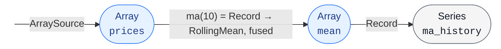

# `tradingflow`

An operator library and event-loop driver for quantitative investment research.

A trading strategy is a static computation graph: feature extraction, model prediction, portfolio optimization, trading simulation and performance evaluation are all operator nodes. Writing a backtest amounts to wiring together reusable operators; new operators are readily implemented. This crate provides the operators, the data sources, and the timestamp-ordered event loop that drives them — layered on the [`tradingflow-graph`](../tradingflow-graph/README.md) computation-graph engine and the [`tradingflow-data`](../tradingflow-data/README.md) data model.

**`tradingflow` is the only dependency a strategy crate needs.** The engine's graph-building vocabulary (`Handle`, `ViewPort`, `Segment`, the combinators, …) is re-exported as `tradingflow::graph` and the fusion macro as `tradingflow::segment!`; the data model (`Array` / `Series` / `Instant`) as `tradingflow::data`.

## Usage

The three things you do in every program: create a `Scenario`, register sources and operators, then `run()` the event loop. Below is a tiny example that records a synthetic price series, takes a rolling mean, and prints its tail.

```rust
use tradingflow::{Array, Instant, Scenario, Series, WallClock};
use tradingflow::operators::{as_view, ma, record};
use tradingflow::sources::ArraySource;

#[tokio::main]
async fn main() {
    // Example data: a random-walk daily price series.
    let timestamps: Vec<_> = (0..90).map(Instant::from_nanos).collect();
    let values: Vec<f64> = /* ... */ vec![100.0; 90];

    // Build the computation graph.
    let mut sc = Scenario::new(WallClock);
    let prices = sc.add_source(ArraySource::new(
        Series::from_vec([], timestamps, values),
        Array::scalar(0.0),
    ));
    let prices = sc.push(as_view(), prices);
    let mean = sc.push(ma(10), prices);
    let ma_history = sc.push(record(), mean);

    // Run the event loop until all sources are exhausted, then inspect results.
    let mut session = sc.build();
    session.run(|_, _| {}).await;
    let series: &Series<f64, 0> = session.ref_view(ma_history);
    println!("{:?}", series.values());
}
```

The resulting computation graph:



This is the whole pattern. An actual strategy can contain many more operators — `ForwardAdjust`, `LinearRegression`, `Shrinkage`, `MeanVariancePortfolio`, `RandomTrader`, `SharpeRatio` — but the structure stays the same.

Every segment has a lowercase free constructor — `ma(10)`, `winsorize(p)`, `record()`, the view-currency bridges `as_view()` / `own()` — whose `T` / `N` generics are inferred from the wiring; formula-shaped signals compose with the `tradingflow::segment!` macro, so a fused node carries no type annotations beyond its parameters. Windowed operators (`ma` / `lag` / `record`) never take a clock: **event time is ambient**, carried as the engine's graph-level context and advanced by the driver before each step. Behind the `python` feature, operators can additionally be written in Python and run on an embedded interpreter, giving strategies direct access to the Python data-science ecosystem.

## Learn more

- **Writing a custom operator**, or the engine internals (segments, interfaces, the notification contract, fusion): the [`tradingflow-graph` README](../tradingflow-graph/README.md).
- **The data model** (`Array` / `Series` / `Instant`): the [`tradingflow-data` README](../tradingflow-data/README.md).
- **End-to-end strategies** on A-shares market data: the [`examples/`](../../examples/README.md) directory.
- Run `cargo doc --open` for the full API reference.
